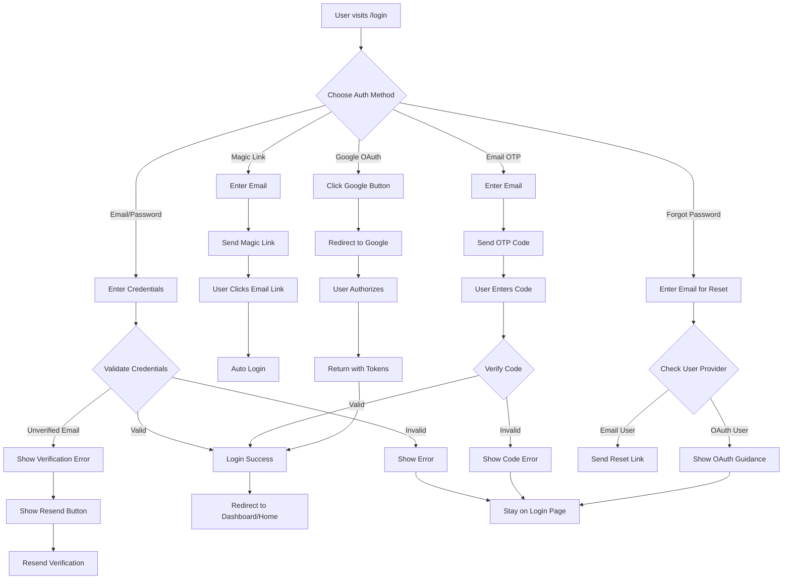
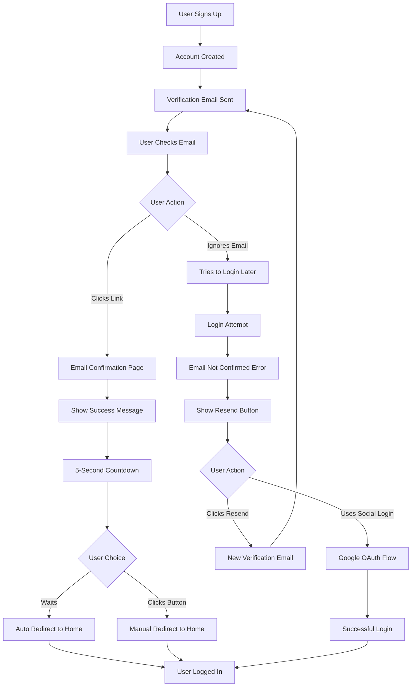
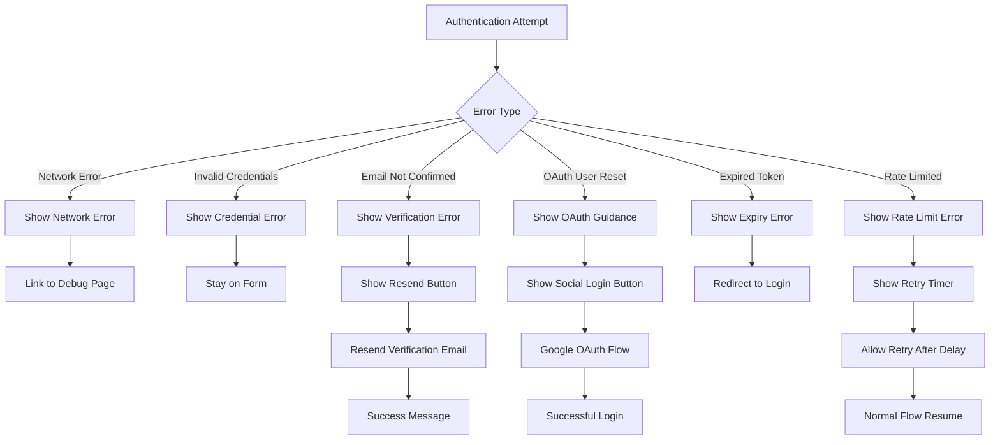
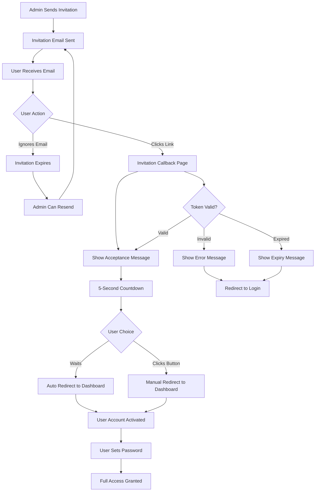

# Complete Authentication System Documentation

## 📋 Table of Contents
1. [Overview](#overview)
2. [Authentication Methods](#authentication-methods)
3. [Flow Diagrams](#flow-diagrams)
4. [Error Handling](#error-handling)
5. [Demo Mode](#demo-mode)
6. [Implementation Details](#implementation-details)
7. [Testing Guide](#testing-guide)

## 🎯 Overview

The Thumboard authentication system provides a comprehensive, user-friendly authentication experience with multiple sign-in methods, robust error handling, and seamless user flows.

### Key Features
- ✅ **6 Authentication Methods**: Email/Password, Magic Link, Email OTP, Google OAuth, Password Reset, User Invitations
- ✅ **Smart Error Handling**: Context-aware error messages with actionable solutions
- ✅ **Email Verification Flow**: Complete signup to verification to confirmation flow
- ✅ **User Invitation System**: Complete invitation and acceptance flow
- ✅ **Demo Mode**: Full testing capability without real backend
- ✅ **Responsive Design**: Consistent monochrome UI across all flows
- ✅ **Security**: Row Level Security (RLS) ready, JWT-based sessions

## 🔐 Authentication Methods

### 1. Email/Password Authentication
**Traditional signup and login with email and password**

**Features:**
- Email validation
- Password strength requirements (6+ characters)
- Secure password hashing via Supabase
- Email verification required for new accounts

**User Flow:**
1. User enters email and password
2. System validates credentials
3. If new user: Account created, verification email sent
4. If existing user: Login successful or error shown
5. Redirect to intended destination

### 2. Magic Link Authentication
**Passwordless login via email link**

**Features:**
- No password required
- Secure one-time login links
- Email-based authentication
- Automatic session creation

**User Flow:**
1. User enters email address
2. Magic link sent to email
3. User clicks link in email
4. Automatic login and redirect

### 3. Email OTP Authentication
**6-digit verification code via email**

**Features:**
- Time-limited verification codes
- Secure code generation
- Resend capability
- Code expiration handling

**User Flow:**
1. User enters email address
2. 6-digit code sent to email
3. User enters code in app
4. Code verified and session created

### 4. Google OAuth
**Social login with Google account**

**Features:**
- OAuth 2.0 integration
- Secure Google authentication
- Profile information import
- No password required

**User Flow:**
1. User clicks "Continue with Google"
2. Redirected to Google OAuth
3. User authorizes application
4. Redirected back with tokens
5. Session created automatically

### 5. Password Reset
**Secure password recovery**

**Features:**
- Email-based reset links
- Secure token generation
- Provider detection (OAuth vs email users)
- Clear user guidance

**User Flow:**
1. User enters email for reset
2. System checks user provider
3. If email user: Reset link sent
4. If OAuth user: Guidance to use social login
5. User follows reset process

### 6. User Invitations
**Admin-initiated user onboarding**

**Features:**
- Admin sends invitation emails
- Secure invitation tokens
- Password setup during acceptance
- Automatic account activation

**User Flow:**
1. Admin sends invitation to email
2. User receives invitation email
3. User clicks invitation link
4. Invitation acceptance page with countdown
5. User sets password and gains access

## 📊 Flow Diagrams

### Complete Authentication Flow



### Email Verification Flow



### Error Handling Flow



### User Invitation Flow



### Demo Mode Flow

```mermaid
flowchart TD
    A[App Starts] --> B{Supabase Configured?}

    B -->|Yes| C[Real Mode]
    B -->|No| D[Demo Mode]

    C --> E[Use Supabase APIs]
    D --> F[Use Demo Functions]

    E --> G[Real Authentication]
    F --> H[Simulated Authentication]

    H --> I{Demo Scenarios}
    I -->|Normal Email| J[Simulate Success]
    I -->|"unverified" Email| K[Simulate Unverified]
    I -->|OTP Code "123456"| L[Simulate OTP Success]
    I -->|Google OAuth| M[Simulate OAuth Success]

    J --> N[Demo User Session]
    K --> O[Demo Verification Error]
    L --> N
    M --> N

    G --> P[Real User Session]
    N --> Q[Continue to App]
    P --> Q
```

## 🚨 Error Handling

### Error Categories

#### 1. Network Errors
**Cause:** Connection issues, server downtime, network problems
**Detection:** Catch blocks in API calls, fetch failures
**User Experience:**
- Clear error message: "Network error: Unable to connect..."
- Link to debug page for troubleshooting
- Retry suggestions

**Example:**
```
❌ Network error: Unable to connect to authentication service.
   Please check your internet connection and try again.

   [Visit debug page for troubleshooting →]
```

#### 2. Email Not Confirmed Errors
**Cause:** User tries to login before verifying email
**Detection:** `email_not_confirmed` error from Supabase
**User Experience:**
- Specific error message about email verification
- Automatic resend verification button
- Clear next steps

**Example:**
```
❌ Email not confirmed. Please check your email and click
   the verification link, or request a new verification email.

   [Resend Verification Email]
```

#### 3. Invalid Credentials Errors
**Cause:** Wrong email/password combination
**Detection:** `Invalid login credentials` from Supabase
**User Experience:**
- Clear error message
- No indication of which field is wrong (security)
- Suggestion to use forgot password

**Example:**
```
❌ Invalid email or password. Please check your credentials
   and try again.
```

#### 4. OAuth User Password Reset Errors
**Cause:** OAuth user tries to reset password
**Detection:** Provider check shows OAuth user
**User Experience:**
- Explanation that they use social login
- Direct link to social login option
- Clear guidance

**Example:**
```
❌ This email is associated with Google login. Please sign in
   using your Google account instead of using a password.

   [Continue with Google]
```

#### 5. Configuration Errors
**Cause:** Missing or invalid Supabase configuration
**Detection:** Environment variable validation
**User Experience:**
- Automatic fallback to demo mode
- Clear indication of demo mode
- Instructions for proper setup

**Example:**
```
🎭 Demo Mode Active
   Supabase is not configured. Using demo authentication for testing.
```

### Error Recovery Strategies

#### 1. Automatic Fallbacks
- **Demo Mode**: When Supabase unavailable
- **Retry Logic**: For transient network errors
- **Alternative Methods**: Suggest different auth methods

#### 2. User Guidance
- **Actionable Messages**: Tell users exactly what to do
- **Help Links**: Direct links to debug/help pages
- **Alternative Options**: Show other ways to proceed

#### 3. Progressive Enhancement
- **Graceful Degradation**: Core functionality always works
- **Feature Detection**: Adapt to available capabilities
- **Fallback UI**: Simple alternatives when features fail

## 🎭 Demo Mode

### Purpose
Demo mode allows complete testing of the authentication system without requiring a real Supabase backend. Perfect for development, testing, and demonstrations.

### Activation
Demo mode activates automatically when:
- `NEXT_PUBLIC_DEMO_MODE=true` in environment
- Supabase configuration is missing or invalid
- Supabase project is unreachable

### Demo Behaviors

#### 1. Authentication Methods
**Email/Password:**
- Any email + password (6+ chars) = Success
- Emails with "unverified" = Email verification error
- Short passwords = Invalid credentials error

**Magic Link:**
- Any email = "Magic link sent" message
- Simulates email sending process

**Email OTP:**
- Any email = "OTP sent" message
- Code "123456" = Success
- Other codes = Invalid code error

**Google OAuth:**
- Simulates OAuth redirect flow
- Creates demo user session

**Password Reset:**
- Gmail addresses = OAuth user error
- Other emails = Reset email sent

#### 2. Demo User Creation
```javascript
{
  id: 'demo-user-[random]',
  email: '[user-provided]',
  email_confirmed_at: '[current-time]',
  user_metadata: {
    full_name: '[provided-name]',
    display_name: '[provided-name]'
  }
}
```

#### 3. Demo Session
```javascript
{
  access_token: 'demo-access-token',
  refresh_token: 'demo-refresh-token',
  expires_in: 3600,
  token_type: 'bearer',
  user: [demo-user]
}
```

### Demo Indicators
- Blue banner: "🎭 Demo Mode Active"
- Console logs: "Demo mode: [action]"
- Special instructions for OTP code
- Clear indication in debug page

## 🛠 Implementation Details

### File Structure
```
src/
├── lib/
│   └── supabase.ts              # Core auth functions
├── components/
│   └── auth/
│       └── auth-form.tsx        # Main auth UI component
├── hooks/
│   └── use-auth.ts              # Auth hook for components
├── app/
│   ├── auth/
│   │   └── callback/
│   │       └── page.tsx         # OAuth/email callback handler
│   ├── login/
│   │   └── page.tsx             # Login page
│   ├── signup/
│   │   └── page.tsx             # Signup page
│   ├── debug/
│   │   └── page.tsx             # Debug/troubleshooting page
│   └── test-*/
│       └── page.tsx             # Various test pages
└── middleware.ts                # Route protection
```

### Core Functions

#### Authentication Functions (`src/lib/supabase.ts`)
```typescript
// Main auth functions
signUp(signUpData: SignUpData): Promise<AuthResult>
signIn(email: string, password: string): Promise<AuthResult>
signInWithMagicLink(email: string): Promise<AuthResult>
signInWithEmailOTP(email: string): Promise<AuthResult>
signInWithGoogle(): Promise<AuthResult>
verifyOTP(email: string, token: string): Promise<AuthResult>
resetPassword(email: string): Promise<AuthResult>
resendVerificationEmail(email: string): Promise<AuthResult>

// Utility functions
checkUserProvider(email: string): Promise<ProviderResult>
testSupabaseConnection(): Promise<ConnectionResult>
isSupabaseConfigured(): boolean
```

#### Auth Hook (`src/hooks/use-auth.ts`)
```typescript
const useAuth = () => ({
  // Authentication methods
  signUp: (data: SignUpData) => Promise<AuthResult>,
  signIn: (email: string, password: string) => Promise<AuthResult>,
  signInWithMagicLink: (email: string) => Promise<AuthResult>,
  signInWithEmailOTP: (email: string) => Promise<AuthResult>,
  signInWithGoogle: () => Promise<AuthResult>,
  verifyOTP: (email: string, token: string) => Promise<AuthResult>,

  // Password management
  resetPassword: (email: string) => Promise<AuthResult>,
  resendVerificationEmail: (email: string) => Promise<AuthResult>,
  checkUserProvider: (email: string) => Promise<ProviderResult>,

  // User management
  updatePassword: (password: string) => Promise<AuthResult>,
  updateUserMetadata: (metadata: object) => Promise<AuthResult>,
  signOut: () => Promise<void>
})
```

### UI Components

#### Auth Form (`src/components/auth/auth-form.tsx`)
**Features:**
- Multi-step authentication flow
- Dynamic error handling with contextual messages
- Resend verification functionality
- Loading states and success feedback
- Responsive design with monochrome styling

**States:**
- `auth-method`: Choose authentication method
- `credentials`: Enter email/password
- `otp-verify`: Enter OTP code
- `password-reset`: Reset password form

#### Callback Handler (`src/app/auth/callback/page.tsx`)
**Handles:**
- Email confirmation callbacks
- OAuth authentication callbacks
- Error callbacks with proper messaging
- Demo mode simulation

**Features:**
- Email confirmation page with countdown timer
- Automatic redirect after 5 seconds
- Manual redirect button
- Error handling with user guidance

## 🧪 Testing Guide

### Test Pages Available

#### 1. Email Verification Test (`/test-email-verification`)
**Purpose:** Test unverified email handling and resend functionality
**Test Cases:**
- Signup with unverified email
- Login attempt with unverified email
- Resend verification email
- Provider detection

#### 2. Email Confirmation Test (`/test-email-confirmation`)
**Purpose:** Test email confirmation callback flow
**Test Cases:**
- Email confirmation success with countdown
- OAuth callback (immediate redirect)
- Error callback handling

#### 3. OAuth Reset Test (`/test-oauth-reset`)
**Purpose:** Test password reset for OAuth users
**Test Cases:**
- Provider detection for different email types
- Password reset for email users
- OAuth user guidance for social login

#### 4. Invitation Test (`/test-invitation`)
**Purpose:** Test user invitation and acceptance flow
**Test Cases:**
- Send invitation to email
- Accept invitation with token
- Invitation callback page testing
- Token validation scenarios

#### 5. Debug Page (`/debug`)
**Purpose:** Troubleshoot configuration and connectivity
**Features:**
- Supabase connection testing
- Environment variable validation
- Browser information display
- Configuration status check

### Testing Scenarios

#### Scenario 1: Complete Email Signup Flow
```
1. Visit /signup
2. Enter email: test@example.com, password: password123
3. Submit form → Account created, verification email sent
4. Click email link → Email confirmation page with countdown
5. Wait 5 seconds OR click "Go to Home Now" → Redirected to home
6. User successfully logged in
```

#### Scenario 2: Unverified Email Login
```
1. Create account but don't verify email
2. Visit /login
3. Enter same credentials → "Email not confirmed" error
4. Click "Resend Verification Email" → New email sent
5. Success message displayed
6. Check email and click verification link
```

#### Scenario 3: OAuth User Password Reset
```
1. Sign up with Google OAuth
2. Visit /login → Click "Forgot Password"
3. Enter Google email → OAuth user detected
4. Error message: "Use Google login instead"
5. Click "Continue with Google" → Successful login
```

#### Scenario 4: User Invitation Flow
```
1. Visit /test-invitation
2. Enter email: invited@example.com
3. Click "Send Invitation" → Invitation sent message
4. Click "Test Invitation Callback" → Opens callback page
5. See "Invitation Accepted!" with countdown
6. Wait 5 seconds OR click "Go to Dashboard Now"
7. Redirected to dashboard → User account activated
```

#### Scenario 5: Demo Mode Testing
```
1. Set NEXT_PUBLIC_DEMO_MODE=true OR disable Supabase
2. Visit /login → Demo mode banner appears
3. Test any auth method → Simulated responses
4. Use "unverified" in email → Verification error
5. Use OTP code "123456" → Success
6. All flows work without real backend
```

### Error Testing

#### Network Errors
```
1. Disconnect internet
2. Try any auth method → Network error message
3. Click debug link → Troubleshooting page
4. Reconnect internet → Normal flow resumes
```

#### Invalid Credentials
```
1. Enter wrong email/password
2. Submit → "Invalid email or password" error
3. No indication of which field is wrong
4. Try correct credentials → Success
```

#### Configuration Errors
```
1. Remove Supabase environment variables
2. Restart app → Demo mode activates automatically
3. Demo banner appears on auth pages
4. All functionality works in demo mode
```

## 📋 Complete Feature Matrix

| Feature | Status | Demo Mode | Error Handling | UI State |
|---------|--------|-----------|----------------|----------|
| Email/Password Auth | ✅ | ✅ | ✅ | ✅ |
| Magic Link Auth | ✅ | ✅ | ✅ | ✅ |
| Email OTP Auth | ✅ | ✅ | ✅ | ✅ |
| Google OAuth | ✅ | ✅ | ✅ | ✅ |
| Password Reset | ✅ | ✅ | ✅ | ✅ |
| User Invitations | ✅ | ✅ | ✅ | ✅ |
| Email Verification | ✅ | ✅ | ✅ | ✅ |
| Email Confirmation | ✅ | ✅ | ✅ | ✅ |
| Resend Verification | ✅ | ✅ | ✅ | ✅ |
| Provider Detection | ✅ | ✅ | ✅ | ✅ |
| Network Error Handling | ✅ | ✅ | ✅ | ✅ |
| OAuth User Guidance | ✅ | ✅ | ✅ | ✅ |
| Debug Tools | ✅ | ✅ | ✅ | ✅ |
| Test Pages | ✅ | ✅ | ✅ | ✅ |
| Responsive Design | ✅ | ✅ | ✅ | ✅ |
| Monochrome UI | ✅ | ✅ | ✅ | ✅ |

## 🎯 Summary

The Thumboard authentication system provides:

✅ **Complete Coverage**: 6 authentication methods with full error handling
✅ **User-Friendly**: Clear messages, actionable errors, smooth flows
✅ **Developer-Friendly**: Demo mode, test pages, debug tools
✅ **Production-Ready**: Real Supabase integration, security best practices
✅ **Maintainable**: Clean code structure, comprehensive documentation
✅ **Testable**: Extensive test scenarios and validation tools

The system handles every authentication scenario gracefully, provides excellent user experience, and offers comprehensive testing capabilities for developers.
